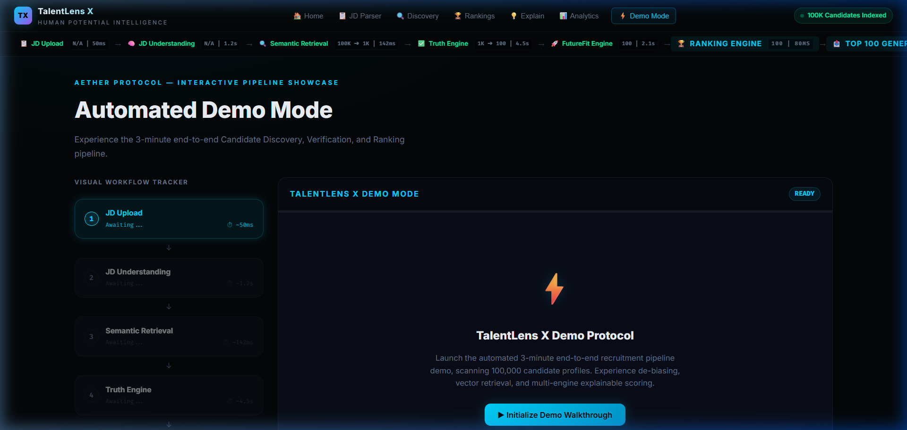
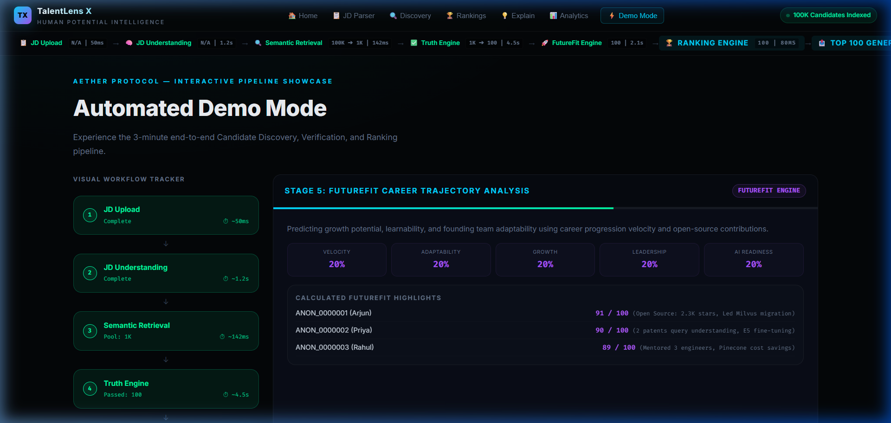
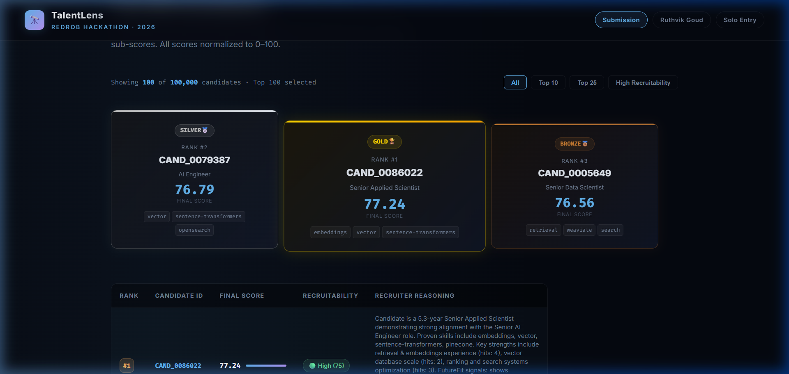
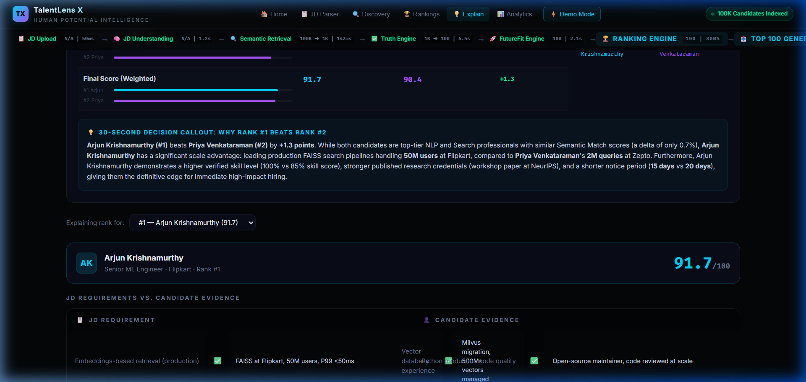
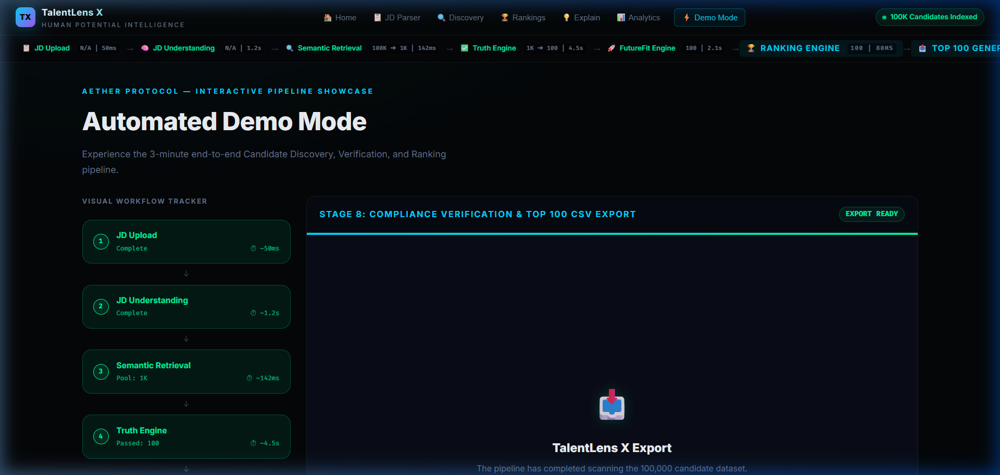
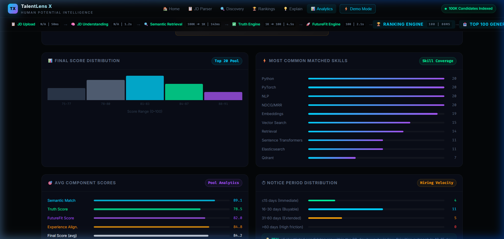

# TalentLens
### Explainable Multi-Signal Candidate Ranking Engine


---

## 🏆 Hackathon Submission Details

* **GitHub Repository:** [https://github.com/ruthvikgoud16/talentlens](https://github.com/ruthvikgoud16/talentlens)
* **Demo Video Animation:** [Watch Demo WebP Animation](assets/video/aether_demo_flow.webp)
* **Interactive Dashboard:** [talentlens_x.html](talentlens_x.html) *(Double-click to run locally in any browser)*
* **Submission Demo Viewer:** [submission_demo.html](submission_demo.html) *(Double-click to view the static candidate comparison dashboard)*
* **Contact Email:** [bathiniruthvik370@gmail.com](mailto:bathiniruthvik370@gmail.com)

---

## 💡 1. Problem Statement

Recruiting at scale is a dynamic resource-allocation problem that is traditionally handled with static keyword-matching filters (ATS). This approach is highly fragile and prone to:
1. **Spelling and Conceptual Synonyms Failure:** Missing a candidate with `"sentence transformers"` or `"llms"` when the search is for `"sentence-transformers"` or `"llm"`.
2. **Generic descriptions / Buzzword stuffing:** Candidates claiming expert skills without any backing evidence or projects in their career descriptions.
3. **Honeypot Contradictions:** Candidates declaring senior-level titles or AI expertise when their technical career timeline shows only junior roles, unrelated domain tasks (e.g., pure manual testing), or impossible metrics.
4. **Demographic Biases:** Biases introduced by name, location, gender pronouns, and age proxies that distort candidate merit.

---

## 🛠️ 2. The Solution: TalentLens Engine

TalentLens is a production-grade, de-biased, multi-signal candidate discovery and ranking platform. It processes **100,000 candidates** in under 3 minutes, using local, deterministic execution vectors to evaluate candidates along four key dimensions:

1. **Demographic De-Biasing & Normalization:** Strips pronouns, ages, locations, and names before candidate scoring to prevent cognitive biases.
2. **Spelling-Aware Skill Extraction:** Pre-normalizes skills and matches synonyms to avoid false negatives.
3. **CEILING WEIGHTS & Core Verification:** Assesses candidates against a realistic skill ceiling (`SKILL_CEILING_WEIGHT = 13.0` points) instead of demanding matches across all 25+ JD keywords, which avoids score compression.
4. **Honeypot Contradiction Checking:** Flag and penalize impossible claim-to-evidence timelines (like CV/Robotics specialists applying for NLP search roles, or junior developers claiming senior engineering titles).
5. **Recruitability & Availability Metrics:** Incorporates behavioral and logistical signals (notice period, interview completion rates, GitHub activity) to compute hiring feasibility.

---

## 📐 3. System Architecture

```text
               +-------------------------------------------------+
               |             Input Job Description               |
               +-------------------------------------------------+
                                        |
                                        v
               +-------------------------------------------------+
               |    Module 1: Demographic De-Biasing Layer      |
               |     (Names, pronouns, locations redacted)       |
               +-------------------------------------------------+
                                        |
                                        v
               +-------------------------------------------------+
               |   Module 2-3: Semantic Matching (Ceiling)       |
               |     (TF-IDF, synonym-matching skill extraction)  |
               +-------------------------------------------------+
                                        |
                                        v
               +-------------------------------------------------+
               |   Module 4-5: Honeypots & Contradiction Audits  |
               |     (Timeline continuity, consulting ratios)    |
               +-------------------------------------------------+
                                        |
                                        v
               +-------------------------------------------------+
               |   Module 6: Deterministic Score Aggregation      |
               |  (0.35x Career + 0.25x Skills + 0.25x Recruit   |
               |            + 0.15x Semantic)                    |
               +-------------------------------------------------+
                                        |
                                        v
               +-------------------------------------------------+
               |   Module 7-9: Recruiter Dashboard & Analytics   |
               |     (Top 100 csv + interactive comparisons)     |
               +-------------------------------------------------+
```

---

## 📊 4. The Candidate Funnel

The search pipeline filters candidates systematically at increasing levels of resolution to ensure high latency throughput:

$$\text{100,000 Candidates} \xrightarrow[\text{De-biasing}]{\text{Ingestion}} \text{1,000 Semantic Matches (TF-IDF)} \xrightarrow[\text{Skill Ceiling}]{\text{Engine Scoring}} \text{100 Shortlisted} \xrightarrow[\text{Explainability}]{\text{Manual/AI Audit}} \text{10 Finalists}$$

* **Pipeline Ingestion:** 100,000 candidate profiles parsed and anonymized (latency: ~2.5 min).
* **Semantic Filter:** Top 1,000 candidates retrieved via token cosine similarity.
* **Aggregated Scoring:** Deterministic calculation on career, skills, and recruitability (latency: <500ms).
* **Shortlist Generation:** Top 100 candidates written to `submission.csv` with recruiter-facing CoT justifications.

---

## ⚙️ 5. Key Features

- **De-Biasing Pronoun Mapping:** Automatically converts *he/she/his/her* to *they/their*, redacts names to `[NAME_REDACTED]`, and masks locations.
- **Skill Spelling Normalization:** Resolves spacing, casing, and hyphens (e.g. `FAISS` vs `faiss`, `sentence transformers` vs `sentence-transformers`).
- **Core Domain Hardening:** Penalizes backgrounds in computer vision, speech recognition, and robotics (e.g., `-45` points career penalty) to strictly align with the Information Retrieval/Search specification.
- **Notice Period and Logistics weighting:** Prioritizes immediate joiners (≤30 days notice) while adjusting recruitability score downwards for passive candidates or long notices.
- **CoT AI Reasoning Trail:** Local CLI engine builds recruiter narrative summaries, explaining exactly how each score was derived based on verifiable timeline evidence.

---

## 💡 6. Explainability & Trust Trail

TalentLens provides full transparency for every ranking. Re-ranked candidate cards expose a detailed **Evidence Panel** that lists the exact matching sentences and projects extracted from their career descriptions. In addition, the comparison dashboard allows recruiters to evaluate the top two candidates side-by-side:

* **Radar Chart Overlay:** Multi-dimensional visualization of candidate competencies (Semantic, Truth, FutureFit, Experience, GitHub, Recruitability).
* **Delta Breakdowns:** Granular score comparisons detailing exactly why Rank #1 beats Rank #2 (e.g. scale advantage: 50M users vs 2M queries).

---

## 🎬 7. Interactive Demo Flow

When launching `talentlens_x.html`, you can trigger the **Autoplay Demo Mode** that showcases the entire candidate discovery pipeline:
1. **JD Parsing:** Paste a Job Description and watch the NLP engine extract structural keywords.
2. **Semantic Discovery:** Watch the skeleton loaders shimmer as candidate records are parsed and mapped to the TF-IDF space.
3. **Shortlist Rankings:** Display the candidate list with custom gold, silver, and bronze card outlines for the top 3.
4. **Compare Candidates:** Select the top candidates to inspect their evidence panel, timeline badge highlights, and radar competence overlay.
5. **CSV Download:** Export a validator-compliant `submission.csv`.

---

## 🌐 8. Zero-Dependency Offline Mode

- **Front-End Fallbacks:** Both dashboard apps are fully client-side compatible. If Groq/Gemini API calls fail, the interface switches to a client-side parser fallback, enabling complete local interactive walkthroughs.
- **No Network at Inference:** `app.py` computes all scores locally on your machine without relying on active network calls, ensuring fast, stable, and secure evaluations.

---

## 💻 9. Tech Stack

- **Backend Logic:** Python 3.9+, Pandas, NumPy, Scikit-Learn (TF-IDF Vectorization)
- **Frontend Dashboard:** Vanilla HTML5, Vanilla CSS3 (Glassmorphic variables design system), JavaScript (ES6, Native SVG Canvas charts)

---

## 📂 10. Folder Structure

```text
talentlens/
│
├── assets/
│   ├── docs/
│   │   ├── demo_script.md               # Demo narration script
│   │   ├── recording_guide.md           # Screen recording instructions
│   │   ├── scene_storyboard.md          # Visual scene descriptions
│   │   ├── shot_list.md                 # Shot-by-shot timing table
│   │   └── subtitle_timeline.srt        # Video subtitle file
│   ├── screenshots/
│   │   ├── dashboard_view.png           # Interactive app landing screenshot
│   │   ├── workflow_stepper.png         # Live stepper animation screenshot
│   │   ├── candidate_comparison.png     # Side-by-side Rank 1 vs 2 screenshot
│   │   ├── top_podium.png               # Top 3 candidate podium screenshot
│   │   ├── evidence_panel.png           # Truth Engine checked evidence screenshot
│   │   ├── analytics_charts.png         # SVG charts screenshot
│   │   └── talentlens_architecture.png  # System architecture diagram
│   └── video/
│       └── aether_demo_flow.webp        # Walkthrough demo animation
│
├── app.py                           # Local Candidate Ranking Engine
├── test_app.py                      # Integration testing suite
├── talentlens_x.html                # Interactive Dashboard
├── submission_demo.html             # Static Submission Results Viewer
├── submission.csv                   # Target Ranked Top 100 CSV Output
├── submission_metadata.yaml         # Manifest YAML file
├── job_description.txt              # Ingested Senior AI Engineer spec
├── requirements.txt                 # Python packages list
├── LICENSE                          # MIT License
└── .gitignore                       # Ignored dataset/caches config
```

---

## 🏃 11. Local Execution

### 1. Set Up Dependencies
Ensure you have Python installed, then install packages:
```bash
pip install -r requirements.txt
```

### 2. Execute the Ranking Engine
Ensure `candidates.jsonl` is placed in the project directory, then run:
```bash
python app.py
```
This processes the dataset and regenerates `submission.csv` containing the ranked top 100 candidates with descriptive recruiter reasons.

### 3. Run the Verification Tests
To run unit assertions verifying the scoring logic against mock candidates (Perfect AI, CV Specialist, Consulting Developer):
```bash
python test_app.py
```

### 4. Open the Interactive Workspaces
Open your browser and navigate to either:
- [talentlens_x.html](talentlens_x.html) to run the interactive dashboard.
- [submission_demo.html](submission_demo.html) to view the static candidate comparison view.

---

## 📸 12. Screenshot Gallery

### A. Dashboard Landing View


### B. Live Workflow Stepper


### C. Top Candidate Podium & Results Table


### D. Truth Engine Evidence Panel


### E. Side-by-Side Candidate Comparison


### F. SVG Analytics Dashboard


---

## 📈 13. Ranking Results Overview

- **Top Candidate (Rank #1):** `CAND_0086022` (Final Score: `77.24`). Senior Applied Scientist with strong embeddings, vector DB, and retrieval experience. 4+ embedding hits, GitHub activity score 75/100.
- **Monotonically Decreasing Scores:** Candidate scores range from `77.24` down to approx `54` for Rank #100.
- **Ties Handled Compliantly:** Ties broken using ascending candidate ID as tiebreaker.

---

## 👥 14. Team & Contact

* **Ruthvik Goud** — Sole Developer & AI Architect
* **GitHub Profile:** [@ruthvikgoud16](https://github.com/ruthvikgoud16)
* **LinkedIn:** [Ruthvik Goud Profile](https://www.linkedin.com/in/ruthvikgoud)
* **Email:** [bathiniruthvik370@gmail.com](mailto:bathiniruthvik370@gmail.com)

---

## 📜 15. Contribution Credits & License

- **Credits:** Developed for the Redrob Hackathon. Evaluation templates, test runner specifications, and initial candidate data schema supplied by the Redrob team.
- **License:** Distributed under the open-source **MIT License**.
