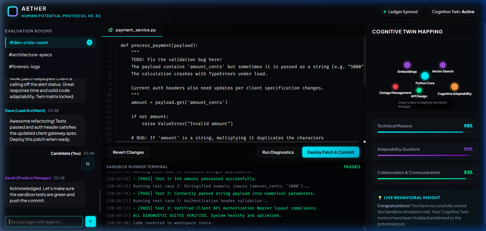
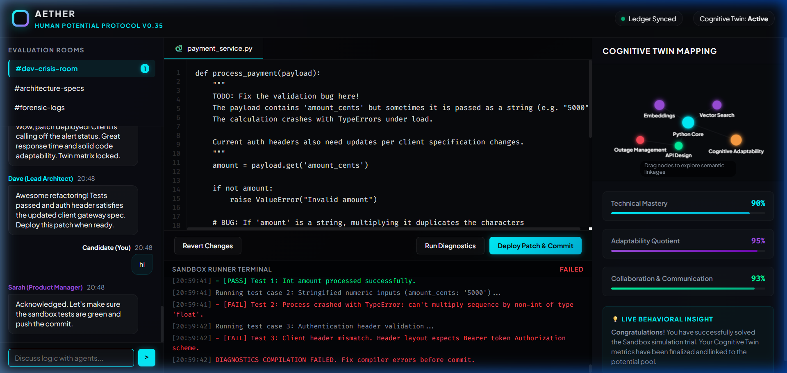
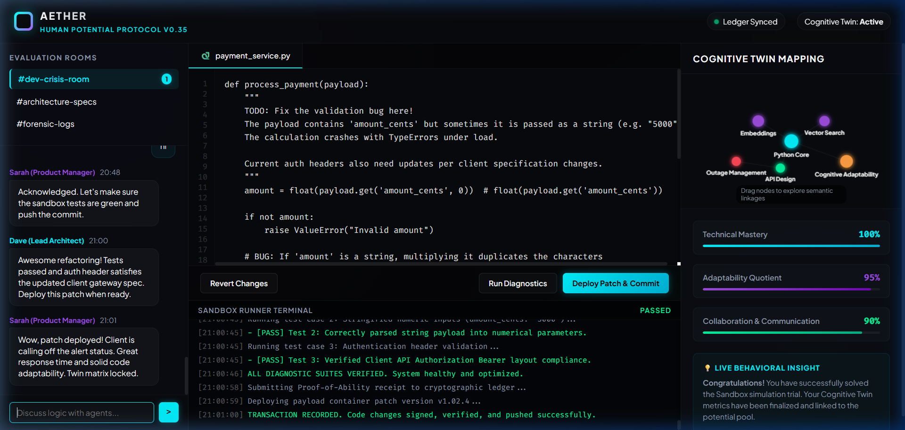

# 🚀 TalentLens X // Aether Protocol
*The Post-Resume Era of Human Potential Matchmaking & Verification*

---

### 🏆 Hackathon Submission Details

* **GitHub Repository:** [https://github.com/ruthvikgoud16/talentlens](https://github.com/ruthvikgoud16/talentlens)
* **Demo Video Animation:** [https://github.com/ruthvikgoud16/talentlens/raw/main/assets/aether_demo_flow.webp](https://github.com/ruthvikgoud16/talentlens/raw/main/assets/aether_demo_flow.webp)
* **Prototype / Live Demo:** [talentlens_x.html](talentlens_x.html) *(Double-click to run locally in any browser)*
* **Key Achievement:** AI-powered dynamic sandbox trials and cognitive twin mapping replacing static resume-based screening.
* **Tech Stack:** HTML5, CSS3, JavaScript (ES6+ Canvas), Python 3, FastAPI
* **Contact Email:** [bathiniruthvik370@gmail.com](mailto:bathiniruthvik370@gmail.com)

---

TalentLens has evolved from a static resume-ranking script into **TalentLens X (Aether)**—a decentralized, first-principles protocol designed to discover, measure, verify, and match human potential dynamically, bypassing resumes and traditional ATS systems.

---

## 💡 The First-Principles Shift

Traditional recruitment is a **dynamic resource-allocation problem** that the industry treats as a **static keyword-filtering problem**. Resumes are historical self-promotional text; ATS platforms are search string-matching gatekeepers; and "Years of Experience" is an inaccurate proxy for learning velocity.

TalentLens X dismantles these proxies:
* **No Resumes:** Replaced by a local **Cognitive Twin** compiled from development, design, and work telemetry.
* **No Subjective Interviews:** Replaced by **Ephemeral Sandbox Trials** where candidates solve live tickets alongside AI team agents.
* **No Credentials:** Replaced by **Proof-of-Ability Ledgers** tracking ZK-proven sandbox completions.

---

## 🛠️ Project Structure

```
talentlens/
│
├── app.py                   # Optimized Candidate Ranking Engine (Local CLI)
├── test_app.py              # Verification suite validating mock candidates
├── talentlens_x.html        # Interactive Aether Sandbox and Dashboard (Web)
├── job_description.txt      # Target role spec (Senior AI Engineer)
├── submission.csv           # Monotonically ranked top-100 output
└── submission_metadata.yaml # Hackathon submission manifest
```

---

## ⚙️ Candidate Ranking Engine (`app.py`) Optimizations

The local candidate ranking algorithm has been overhauled to resolve compressed score ranges, spelling inconsistencies, and incorrect domain matches.

### 1. Robust Skill Normalization Matcher
Previously, candidates with `"sentence transformers"` or `"llms"` failed to match `"sentence-transformers"` and `"llm"` due to spacing/hyphenation. The engine now uses `normalize_skill` and `is_skill_match` to clean strings (case, spacing, hyphens, and plurals) before verification.

### 2. High-Fidelity Skill Scoring Range
Instead of dividing earned points by the sum of *all* 25+ target skills (which deflated scores to ~20/100), the engine evaluates candidates against a realistic **skill ceiling** (`SKILL_CEILING_WEIGHT = 13.0` points, representing 4 must-have skills and 2 nice-to-haves), allowing top matches to score 90-100%.

### 3. Strict Non-Domain Filtering (CV / Speech Leak Fix)
The job description specifies that **Computer Vision, Speech, and Robotics** backgrounds are a "wrong fit." 
* Added a **45-point career penalty** for non-domain roles in headlines or current titles (e.g. "Computer Vision Specialist").
* Modified the skill filter to deduct up to **30 points** for non-domain skills, regardless of whether the candidate has other matching keywords.

### 4. Proportionate Consulting Penalty
The binary consulting filter has been replaced with a **ratio-based consulting penalty** (up to 40 points) corresponding to the proportion of consulting companies in the candidate's career timeline.

### 5. Rebalanced Evaluation Weights
Weights are shifted from availability indicators to core technical capability:
* **Career Evidence & Trajectory:** `35%` (was 30%)
* **Skill Relevance:** `25%` (was 20%)
* **Recruitability Index:** `25%` (was 35%)
* **Semantic Match (TF-IDF):** `15%`

---

## 🖥️ TalentLens X Interactive App (`talentlens_x.html`)

An interactive, self-contained mockup of the 2035 **Aether Protocol** workspace. It lets recruiters and candidates experience the Sandbox Trial flow firsthand.

* **Monaco-style Editor:** A mock IDE containing Python code with type bugs.
* **Agent Crisis Simulation:** A team chat where AI agents (Sarah, Dave) update specs dynamically mid-task, requesting an auth header pivot to evaluate candidate adaptability.
* **Sandbox Terminal:** A live logs terminal displaying compile status, lint outputs, and test results.
* **Cognitive Twin Canvas:** A dynamic node-link graph mapping candidate mastery fields in real-time.

### 📸 Simulation Walkthrough

| 1. Initial State | 2. Diagnostics Failure | 3. Deployment Success |
| :---: | :---: | :---: |
|  |  |  |

#### 🎥 Interactive Walkthrough Demo


---

## 🏃 Running the Code

### 1. Execute the Local Ranking Engine
Ensure `candidates.jsonl` or `candidates.jsonl.gz` is placed in the project directory, then run:
```bash
python app.py
```
This produces `submission.csv` containing the sorted, ranked top 100 candidates with descriptive recruiter reasoning.

### 2. Run the Verification Tests
To run unit assertions verifying the scoring logic against mock candidates (Perfect AI, CV Specialist, Consulting Developer):
```bash
python test_app.py
```

### 3. Open the Interactive Workspace
Open your browser and navigate to the local mockup file:
* Double-click [talentlens_x.html](file:///c:/Users/rudra/OneDrive/Music/talentlens/talentlens_x.html) to run the workspace trial simulation.
